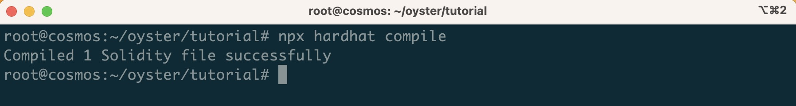
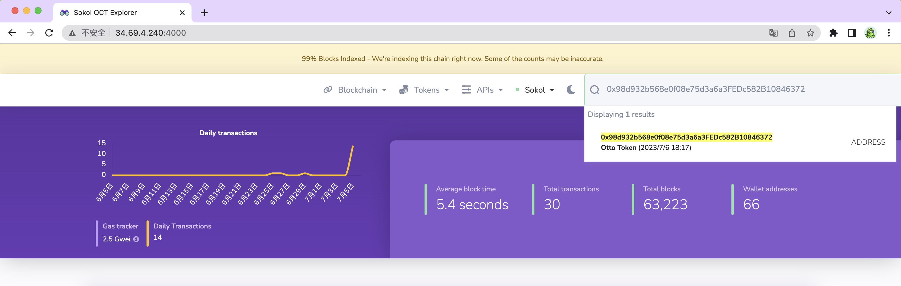

# Hardhat Tutorial

In this tutorial, we'll walk through how we can use the [Hardhat](https://hardhat.org/) to write, deploy a sample Solidity smart contract to OttoChain Testnet.

## Checking Prerequisites

To get started, you should have the following:

* [Node.js](https://nodejs.org/en/download) version 16 or newer installed.
* [VS Code](https://code.visualstudio.com/) with Nomic Foundation's [Solidity extension](https://marketplace.visualstudio.com/items?itemName=NomicFoundation.hardhat-solidity) is a recommended IDE.
* A wallet like [MetaMask](https://metamask.io/) installed.

## Creating a Hardhat Project

You can create a Hardhat project by completing the following steps:

1. Create a project directory

    ```
    mkdir tutorial && cd tutorial
    ```

2. Initialize the project which will create a `package.json` file

    ```
    npm init -y
    ```

3. Install Hardhat

    ```
    npm install hardhat
    ```

4. Create an empty Hardhat project

    ```
    npx hardhat
    ```

5. A menu will appear which will allow you to create a new project or use a sample project. For this example, you can choose **Create an empty hardhat.config.js**


This will create a Hardhat config file (`hardhat.config.js`) in your project directory.

## Hardhat Configuration File

Before you can write and deploy the contract to OttoChain Testnet, you'll need to modify the Hardhat configuration file.

Then you can create a `secrets.json` file under the project directory to store the private key of the pre-funded account `test` which has some `OCT` tokens in OttoChain Testnet by running:

```
touch secrets.json
```

The below content is the private key of the pre-funded account `test` in OttoChain Testnet, you can copy and paste it into `secrets.json`.

```
c3b100addbcfbe3b9506d53d60c7e3d647d9adea1ca7d31af6bc2f6fd9a6b6f6
```

Your `secrets.json` should resemble the following:

```json
{
    "privateKey": "0xc3b100addbcfbe3b9506d53d60c7e3d647d9adea1ca7d31af6bc2f6fd9a6b6f6"
}
```

**Remember**

Make sure to add the file to your project's `.gitignore`. Never reveal or commit your private keys inside your repositories.

When setting up the `hardhat.config.js` file, we'll need the [Hardhat Toolbox plugin](https://hardhat.org/hardhat-runner/plugins/nomicfoundation-hardhat-toolbox){target=_blank}, which conveniently bundles together the packages that we'll need later on for testing. It can be installed with the following command:

```
npm install --save-dev @nomicfoundation/hardhat-toolbox
```

Next you can take the following steps to modify the `hardhat.config.js` file and add OttoChain Testnet as a network:

1. Import the Hardhat Toolbox plugin required to interact with our contracts
2. Import the private key from the `secrets.json` file
3. Inside the `module.exports`, you need to add the OttoChain Testnet network configuration

```javascript
require("@nomicfoundation/hardhat-toolbox");

const { privateKey } = require('./secrets.json');

module.exports = {
  solidity: "0.8.18",

  networks: {
    ottochain: {
      url: 'http://34.69.4.240:8545',
      chainId: 9100,
      accounts: [privateKey],
      gas: 2100000,
      gasPrice: 2000000000      
    },
  }
};
```

You're now ready to move on to development and testing for smart contracts.

## Write an ERC-20 Token Contract

Let's write an ERC-20 token contract that relies on a couple of standard [OpenZeppelin contracts](https://docs.openzeppelin.com/contracts/4.x/). And you can install the OpenZeppelin library with the following command:

```
    npm install @openzeppelin/contracts
```

To get started, take the following steps:

1. Create a `contracts` directory to hold your project's smart contracts

    ```
    mkdir contracts
    ```

2. Create a new file called `OttoToken.sol`

    ```
    touch contracts/OttoToken.sol
    ```

3. Copy and paste the below contents into `OttoToken.sol`

    ```
    // SPDX-License-Identifier: UNLICENSED
    pragma solidity ^0.8.18;

    import "@openzeppelin/contracts/token/ERC20/ERC20.sol";
    import "@openzeppelin/contracts/access/Ownable.sol";

    contract OttoToken is ERC20, Ownable {
        // Total supply: 100 million
        uint256 private constant TOTAL_SUPPLY = 100000000;

        /**
        * @dev Initializes the contract, mint total supply to the deployer (owner).
        */
        constructor() ERC20("Otto Token", "OTTO") {
            _mint(msg.sender, TOTAL_SUPPLY * 10**(uint256(decimals())));
        }
    }    
    ```

## Compiling the Contract

To compile the contract you can simply run:

```
npx hardhat compile
```



After compilation, two new folders `artifacts` and `cache` are created and hold the bytecode and metadata of the contract which are `.json` files. It’s a good idea to add these two folders to your `.gitignore`.

You've now written the smart contract! If this was for a production app, we would write tests for it, but that is out of the scope of this tutorial. Let's deploy it next.

## Deploy Smart Contracts

Hardhat is a Node project that uses the [Ethers.js](https://docs.ethers.org/v6/) library to interact with the blockchain. You can also use Ethers.js with Hardhat's tool to create scripts to do things like deploy contracts.

To deploy the smart contract, you can write a simple script. You can create a new directory for the script and name it `scripts`:

```
mkdir scripts
```

Then add a new file to it called `deploy.js`:

```
touch scripts/deploy.js
```

Next, you need to write your deployment script which can be done using `Ethers.js`, it comes out of the box with Hardhat, so you don't need to worry about installing it yourself.

Then please copy and paste the below contents into `deploy.js`:

```javascript
async function main() {
  const [deployer] = await ethers.getSigners();
  console.log(`Deploying contract with the account: ${deployer.address}`);    
  const tokenContract = await ethers.deployContract('OttoToken');
  const deployedAddress = await tokenContract.getAddress();
  console.log(`Deployed contract to the address: ${deployedAddress}`);
}

main().catch((error) => {
  console.error(error);
  process.exitCode = 1;
});
```

This script first fetches the deployer which is the pre-funded account `test` and prints it. Then it uses the `deployContract` method to deploy the smart contract that we wrote earlier, and then fetches the address of the contract using the contract instance and prints it. 

Let's run the script to deploy the contract on OttoChain Testnet whose JSON-RPC endpoint we defined in the `hardhat.config.js` script earlier:

```
npx hardhat run scripts/deploy.js --network ottochain
```

After a few seconds, the contract is deployed, and you should see an output that displays the token address in the terminal. Make sure to save it for use later!


Congratulations, your contract is live on OttoChain Testnet! Save the address, as you will use it to search in the next step.

## Search Contracts on OttoChain Testnet Explorer

You can open [OttoChain Testnet Explorer](http://34.69.4.240:4000/) and search the contract with its address.



## Interact with the Contract with MetaMask

To get started, take the following steps:

1. You can connect MetaMask to OttoChain Testnet by clicking on the network dropdown and selecting **Add network**.


2. Import the pre-funded account `test` into MetaMask with the private key.


On the import screen, select Private Key and paste in the private key above.


3. Import the token with the contract address, then do the contract interaction to send some tokens to the another address with the account `test`.


4. To check the transaction details with [OttoChain Testnet Explorer](http://34.69.4.240:4000/).


## Conclusion

You can view the complete [tutorial on GitHub](https://github.com/octopus-network/oyster/tree/ottochain/tutorial).